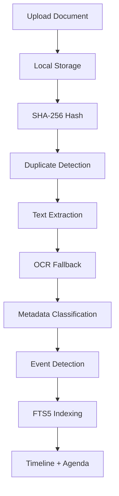
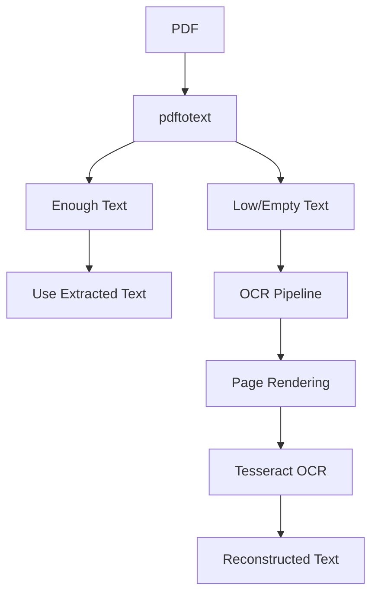
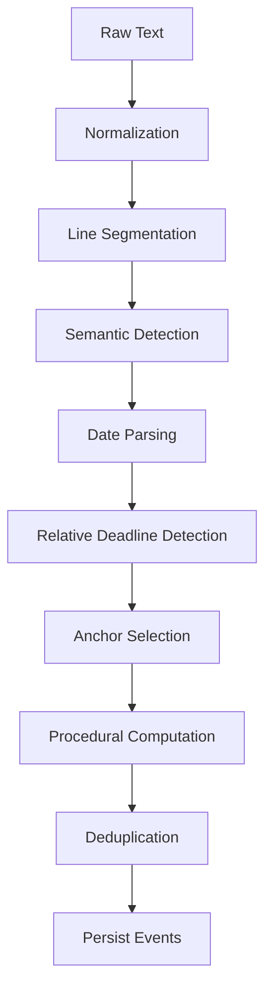
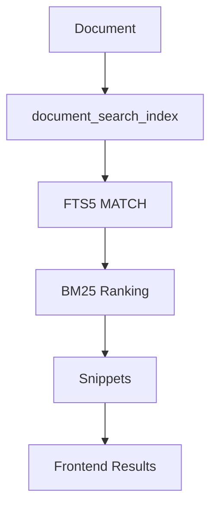
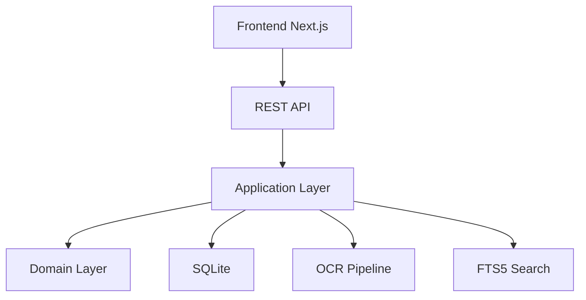

# LEXBOT

> Legal OS local-first para gestión documental jurídica, agenda procesal automatizada y navegación contextual de expedientes.


---

# Overview

LEXBOT transforma documentos jurídicos en información procesal estructurada.

El sistema implementa un pipeline documental completo capaz de:

- importar documentos jurídicos
- extraer texto automáticamente
- aplicar OCR sobre PDFs escaneados
- clasificar documentos jurídicos
- detectar hitos y plazos procesales
- construir timelines jurídicos
- generar agenda procesal
- realizar búsqueda avanzada mediante FTS5
- mantener trazabilidad y revisión humana

---

# Core Features

## Gestión de expedientes

- Clientes
- Expedientes
- Dashboard jurídico
- Agenda procesal
- Timeline procesal
- Notas jurídicas
- Eventos procesales

---

## Pipeline documental completo



---

## OCR automático para PDFs escaneados

LEXBOT soporta extracción híbrida:



Tecnologías:

- Tesseract OCR
- gosseract
- pdftotext
- pdftoppm

---

# Event Engine

## Detección automática de eventos procesales

LEXBOT detecta automáticamente:

- deadlines
- hearings
- notifications
- procedural requirements
- appearances
- appeals
- relative dates
- absolute dates
- business-day rules

---

## Flujo del motor semántico



---

## Relaciones procesales

LEXBOT ya entiende relaciones jurídicas entre hitos:


---

# Procedural Timeline

LEXBOT incluye timeline procesal visual inteligente.

Características:

- relaciones entre eventos
- navegación origen ↔ derivado
- agrupación cronológica
- fases procesales
- métricas visuales
- prioridades jurídicas
- estados temporales
- timelines expandibles

---

# Search Engine

## SQLite FTS5 Search

LEXBOT implementa SQLite FTS5 real.

Características:

- búsqueda global
- búsqueda por expediente
- ranking BM25
- snippets contextuales
- highlights
- búsqueda multi-término
- navegación contextual
- autocomplete jurídico
- Ctrl+K global search

---

## Arquitectura FTS5



---

## Estructura del índice

```text
document_search_index
 ├─ document_id
 ├─ case_file_id
 ├─ original_name
 ├─ content
 ├─ document_type
 └─ legal_area
```

---

# Architecture

LEXBOT sigue arquitectura hexagonal / clean architecture.

## Arquitectura global



---

# Backend Architecture

## Stack

- Go
- SQLite
- SQLite FTS5
- Tesseract OCR
- REST API

---

## Estructura backend

```text
cmd/
internal/
  domain/
  application/
  infrastructure/
  interfaces/
frontend/
migrations/
```

---

## Domain Layer

Entidades puras del negocio.

```text
internal/domain/
  casefile/
  document/
  note/
  calendar/
  shared/
```

Entidades principales:

- CaseFile
- Document
- Event
- Note

---

## Application Layer

Casos de uso:

```text
ImportDocument
SearchDocuments
AnalyzeDocumentMetadata
AnalyzeDocumentEvents
ReviewDocument
ReprocessDocument
ListUpcomingEvents
ExportUpcomingEventsICS
```

---

## Ports Layer

```go
type DocumentRepository interface
type DocumentContentRepository interface
type DocumentEventRepository interface
type DocumentMetadataRepository interface
type DocumentSearchIndexRepository interface

type FileStorage interface
type TextExtractor interface
type FileHasher interface
type IDGenerator interface
```

---

## Infrastructure Layer

Implementaciones reales:

```text
internal/infrastructure/
  extraction/
  persistence/
  search/
  storage/
```

Incluye:

- SQLite repositories
- OCR pipeline
- extractores PDF/DOCX
- hashing SHA-256
- storage local
- FTS5

---

## Interfaces Layer

REST API + CLI.

```text
internal/interfaces/
  http/
  cli/
```

---

# Frontend Architecture

## Stack

- Next.js App Router
- React
- TypeScript

---

## Frontend structure

```text
frontend/
  app/
    components/
    case-files/
  lib/
```

---

## Componentes importantes

### documents-list.tsx

Responsabilidades:

- filtering
- sorting
- searching
- inline actions
- contextual snippets
- review states

---

### procedural-timeline.tsx

Características:

- chronological grouping
- procedural phases
- semantic relations
- priorities
- metrics
- expandable timelines
- contextual navigation

---

### command-palette.tsx

Global Ctrl+K search system.

---

### highlighted-text.tsx

Características:

- multi-term highlights
- navigation ↑ ↓
- sticky controls
- automatic scrolling

---

# REST API

## Main endpoints

```http
GET    /case-files
POST   /case-files
GET    /case-files/{id}
GET    /case-files/{id}/dashboard

POST   /case-files/{id}/documents

GET    /documents/{id}
DELETE /documents/{id}
POST   /documents/{id}/reprocess
POST   /documents/{id}/review
GET    /documents/search

GET    /events/upcoming
GET    /events/upcoming.ics
```

---

# Review System

## Document review states

```text
pending_review
reviewed
error
```

---

## Event review states

```text
pending
reviewed
resolved
```

---

# Local-first Philosophy

LEXBOT prioriza:

- local-first
- deterministic behavior
- auditability
- explainability
- offline-first workflows
- human validation
- traceability

---

# Traceability

Cada evento detectado conserva:

```text
source_text
anchor_date
computation
trigger_text
calendar_scope
procedural_relation
```

El sistema evita “black-box AI”.

Todos los eventos pueden explicarse y auditarse.

---

# Development

## Backend

```bash
go run ./cmd/LEXBOT-api
```

Backend:

```text
http://localhost:8080
```

---

## Frontend

```bash
cd frontend
npm install
npm run dev
```

Frontend:

```text
http://localhost:3000
```

---

# Testing

```bash
go test ./...
```

---

# Roadmap

## Short-term

- semantic query DSL
- saved searches
- recent searches
- timeline bidirectional relations
- advanced filters

---

## Mid-term

- OCR for images
- procedural risk panel
- manual tasks system
- advanced procedural phases
- unified global search

---

## Long-term

- local legal AI
- RAG with traceability
- multi-user support
- audit logs
- desktop packaging (Wails/Tauri)

---

# Vision

LEXBOT busca convertirse en un sistema capaz de:

- navegar jurídicamente expedientes
- entender relaciones procesales
- automatizar control de plazos
- reducir errores humanos
- mantener trazabilidad completa

Todo ello funcionando localmente y sin depender de servicios externos opacos.
